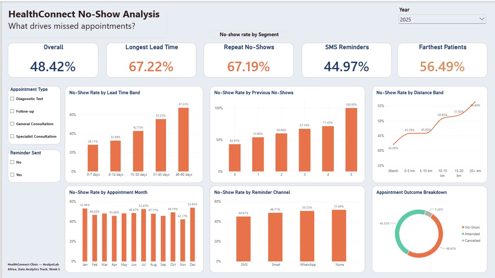

# HealthConnect Clinic – Data Analytics Project

**Programme:** AnalystLab Africa – Experience Lab Internship
**Track:** Data Analytics
**Tools:** Microsoft Excel, Power BI

## Project Overview

HealthConnect Clinic is a fictional healthcare provider facing a high rate of missed
patient appointments. This project explores how data analysis can help the clinic
understand *why* patients miss appointments and where operational changes could
reduce the impact.

**Central question:** How can HealthConnect Clinic use data to reduce missed
appointments and improve the patient support experience?

## Dataset

- `HealthConnect_Appointment_Data.csv` — 5,000 anonymised appointment records
- `HealthConnect_Data_Dictionary.xlsx` — variable definitions and constraints

## Progress Log

### Week 4 — Problem Understanding & Initial Analysis
- Reviewed the dataset and data dictionary; ran a full data quality assessment
  (missing values, duplicates, logical consistency checks)
- Defined 6 business questions around appointment attendance
- Shortlisted 5 KPIs, each linked to a business question, with justification
- Identified assumptions, limitations, risks, and dependencies
- Key early signal: booking lead time and prior no-show history show the
  strongest relationship with no-shows in initial cross-tabulation
- 📄 [Week 4 Initial Analysis Document](./Week4/HealthConnect_Week4_DataAnalytics_InitialAnalysis.docx)

### Week 5 — Exploratory Analysis, KPI Development & Business Insights
- Completed full data preparation in Power Query: confirmed data types, zero
  duplicates, and only two genuine missing-data fields (`distance_to_clinic_km`,
  `waiting_time_minutes`) — corrected a Week 4 assumption along the way:
  `reminder_channel` is a valid 4-category field, not missing data
- Ran exploratory analysis across every relationship in the brief: appointment
  characteristics, patient history, reminders, waiting time, distance, and
  cancellations (analysed separately from no-shows)
- Calculated and interpreted all 5 shortlisted KPIs
- Built a two-page interactive Power BI dashboard (KPI drivers + a dedicated
  page for the weak/non-findings on day, time, age, and gender)
- Produced 6 business insights with clinic-facing recommendations
- Strongest confirmed drivers: booking lead time (27.8% → 67.7% no-show rate)
  and prior no-show history (43.5% → 68%); reminders (SMS most effective) and
  distance have real but smaller effects; day, time, age, gender, and
  appointment type show no meaningful variation

- 📄 [Week 5 Initial Analytics Report](./Week5/HealthConnect_Week5_Project_Summary_AnalyticsReport_Samson_Arawande.docx)

### Week 6 — Advanced Analytics, Integration & Validation
- Deepened Week 5's two strongest findings by testing them together: does
  booking lead time and prior no-show history compound each other, or do the
  effects simply add up?
- Built and validated a Combined Risk matrix (Lead Time × Prior No-Shows) —
  confirmed the two factors are **additive, not multiplicative** (observed
  values track within ~1-4 points of what a simple additive model predicts)
- Validated both strongest KPIs for stability by splitting 2025 into H1/H2 —
  both hold up well; flagged one new caveat (the 8-14 day lead-time band shows
  an 11-point gap between halves that the others don't)
- Ranked all findings by business impact and translated the top ones into
  specific, targeted actions (e.g. a second confirmation touchpoint for 30+
  day bookings, SMS-first reminders, telehealth piloting for the 20+km group)
- Completed a real cross-track integration: the Data Science track requested
  validated findings with full counts and rates to support their model
  refinement — delivered a dedicated findings package answering all 10 of
  their questions, with an open invitation for their error patterns in return
- Improved (not rebuilt) the dashboard — replaced the single-factor chart with
  the new heatmap-styled Combined Risk matrix; everything else preserved from
  Week 5

- 📄 [Week 6 Advanced Analytics Report](./Week6/HealthConnect_Week6_DataAnalytics_AdvancedAnalyticsReport.docx)
- 📄 [Data Science Findings Package](./Week6/HealthConnect_DataAnalytics_to_DataScience_FindingsPackage.docx)

### Week 7 — Planned
- Analyse the Data Science track's returned model error patterns (false
  positives/negatives) and run targeted validation on any weak segments
- Investigate the 8-14 day lead-time band's instability further
- Re-test the interaction finding once 2026 data is complete
- Gather feedback on the dashboard's usability

## Repository Structure
