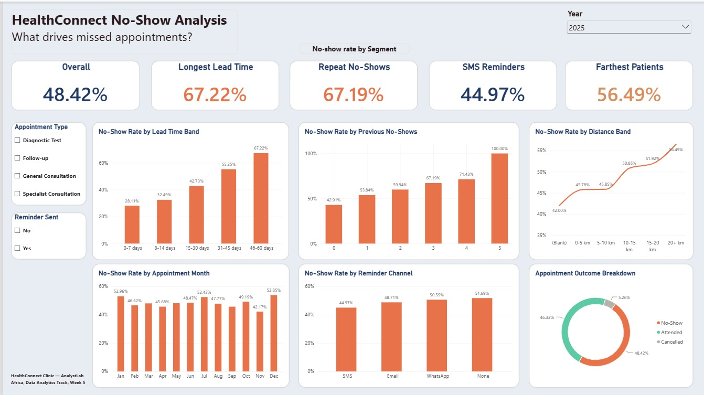

# HealthConnect Clinic – Data Analytics Project

**Programme:** AnalystLab Africa – Experience Lab Internship
**Track:** Data Analytics
**Tools:** Microsoft Excel, Power BI

## Project Overview

HealthConnect Clinic is a fictional healthcare provider facing a high rate of missed
patient appointments. This project explores how data analysis can help the clinic
understand *why* patients miss appointments and where operational changes could
reduce the impact.

**Central question:** How can HealthConnect Clinic use data to reduce missed
appointments and improve the patient support experience?

## Dataset

- `HealthConnect_Appointment_Data.csv` — 5,000 anonymised appointment records
- `HealthConnect_Data_Dictionary.xlsx` — variable definitions and constraints

## Progress Log

### Week 4 — Problem Understanding & Initial Analysis
- Reviewed the dataset and data dictionary; ran a full data quality assessment
  (missing values, duplicates, logical consistency checks)
- Defined 6 business questions around appointment attendance
- Shortlisted 5 KPIs, each linked to a business question, with justification
- Identified assumptions, limitations, risks, and dependencies
- Key early signal: booking lead time and prior no-show history show the
  strongest relationship with no-shows in initial cross-tabulation
- 📄 [Week 4 Initial Analysis Document](./Week4/HealthConnect_Week4_DataAnalytics_InitialAnalysis.docx)

### Week 5 — Exploratory Analysis, KPI Development & Business Insights
- Completed full data preparation in Power Query: confirmed data types, zero
  duplicates, and only two genuine missing-data fields (`distance_to_clinic_km`,
  `waiting_time_minutes`) — corrected a Week 4 assumption along the way:
  `reminder_channel` is a valid 4-category field, not missing data
- Ran exploratory analysis across every relationship in the brief: appointment
  characteristics, patient history, reminders, waiting time, distance, and
  cancellations (analysed separately from no-shows)
- Calculated and interpreted all 5 shortlisted KPIs
- Built a two-page interactive Power BI dashboard (KPI drivers + a dedicated
  page for the weak/non-findings on day, time, age, and gender)
- Produced 6 business insights with clinic-facing recommendations
- Strongest confirmed drivers: booking lead time (27.8% → 67.7% no-show rate)
  and prior no-show history (43.5% → 68%); reminders (SMS most effective) and
  distance have real but smaller effects; day, time, age, gender, and
  appointment type show no meaningful variation



- 📄 [Week 5 Initial Analytics Report](./Week5/HealthConnect_Week5_Project_Summary_AnalyticsReport_Samson_Arawande.docx)

### Week 6 — Advanced Analytics, Integration & Validation
- Deepened Week 5's two strongest findings by testing them together: does
  booking lead time and prior no-show history compound each other, or do the
  effects simply add up?
- Built and validated a Combined Risk matrix (Lead Time × Prior No-Shows) —
  confirmed the two factors are **additive, not multiplicative** (observed
  values track within ~1-4 points of what a simple additive model predicts)
- Validated both strongest KPIs for stability by splitting 2025 into H1/H2 —
  both hold up well; flagged one new caveat (the 8-14 day lead-time band shows
  an 11-point gap between halves that the others don't)
- Ranked all findings by business impact and translated the top ones into
  specific, targeted actions (e.g. a second confirmation touchpoint for 30+
  day bookings, SMS-first reminders, telehealth piloting for the 20+km group)
- Completed a real cross-track integration: the Data Science track requested
  validated findings with full counts and rates to support their model
  refinement — delivered a dedicated findings package answering all 10 of
  their questions, with an open invitation for their error patterns in return
- Improved (not rebuilt) the dashboard — replaced the single-factor chart with
  the new heatmap-styled Combined Risk matrix; everything else preserved from
  Week 5

- 📄 [Week 6 Advanced Analytics Report](./Week6/HealthConnect_Week6_DataAnalytics_AdvancedAnalyticsReport.docx)
- 📄 [Data Science Findings Package](./Week6/HealthConnect_DataAnalytics_to_DataScience_FindingsPackage.docx)
- 📊 [Week 6 Power BI Dashboard](./Week6/HealthConnect_Week6_Dashboard.pbix)

### Week 7 — Analytical Testing, KPI Validation & Dashboard Refinement
- Ran two real tests this week, both following a Test → Finding → Action →
  Retest cycle rather than just re-reporting findings
- **Test 1**: found a genuine dashboard bug — the Year slicer was silently
  filtering every visual on Page 1, not just the trend chart that needed it,
  causing the dashboard (88.24%) to disagree with the written report (91.30%)
  for the same figure. Fixed via Power BI's Edit Interactions, confirmed on
  retest across both slicer states
- **Test 2**: the Data Science track sent back their model's error patterns
  and 7 specific validation requests. Ran H1/H2 time-split stability checks
  plus chi-square significance tests (lead time: p<0.001, no-show history:
  p<0.001) — 5 of 7 concerns confirmed as data-reliable (pointing to genuine
  modelling difficulty, not a data problem), 1 confirmed as a real, unresolved
  limitation (the 8-14 day band's month-to-month volatility), 1 reconfirmed an
  existing small-sample caution
- Delivered a full validated-findings response addressing every one of their
  7 points with real tables, not just conclusions — the strongest evidentiary
  footing this project has had to date
- No new charts added (per the brief — refine, don't rebuild); the dashboard
  fix was corrective, and two recommendation caveats were added based on what
  testing surfaced

- 📄 [Week 7 Testing & Refinement Report](./Week7/HealthConnect_Week7_DataAnalytics_TestingRefinementReport.docx)
- 📄 [Validated Findings for Data Science](./Week7/HealthConnect_Week7_ValidatedFindings_for_DataScience.docx)

### Week 8 — Final Integration, Presentation & Project Showcase
- Consolidated eight weeks of work into one final Analytics & Decision
  Support Package: final KPIs, validated findings, the tested dashboard,
  7 business insights, 5 prioritised recommendations, and a full analytical
  limitations section
- Closed the loop on the Data Science collaboration with a formal, 9-point
  final integration record spanning the entire Week 6→8 exchange — not a
  single handoff, but three rounds of genuine back-and-forth (deliver →
  receive error patterns → validate → deliver again)
- Built a 9-slide final presentation deck (Power BI-matched navy/orange
  palette) covering the problem, the two validated drivers, the additive
  risk-combination finding, the dashboard, recommendations, and the
  cross-track collaboration story
- Bottom line for HealthConnect Clinic: two measurable, statistically
  significant factors — booking lead time and prior no-show history — drive
  most preventable no-shows, they combine predictably (not multiplicatively),
  and the clinic already has a low-cost lever (SMS reminders) it can deploy
  today

- 📄 [Week 8 Final Analytics & Decision Support Package](./Week8/HealthConnect_Week8_DataAnalytics_FinalPackage.docx)
- 📊 [Week 8 Final Presentation Deck](./Week8/HealthConnect_Week8_FinalPresentation.pptx)

## Project Retrospective

Across 8 weeks, this project moved from initial problem understanding to a
validated, statistically tested, cross-track-integrated analytics solution:

- **Weeks 4-5**: defined the problem, cleaned and validated the dataset,
  built the first KPIs and dashboard
- **Week 6**: deepened the analysis (the lead-time × history interaction),
  began real cross-track collaboration with Data Science
- **Week 7**: stress-tested everything — found and fixed a real dashboard
  bug, formally validated both core findings with statistical significance
  tests (p<0.001), and answered 7 specific validation requests from Data
  Science with evidence, not assumptions
- **Week 8**: consolidated everything into a final, presentation-ready
  package and closed the collaboration loop

The single most valuable outcome wasn't a chart — it was proving that
findings held up under independent, adversarial scrutiny from another track,
and that those findings measurably shaped someone else's work.

## Repository Structure

```
/Week4
  HealthConnect_Week4_DataAnalytics_InitialAnalysis.docx
/Week5
  HealthConnect_Week5_Project_Summary_AnalyticsReport_Samson_Arawande.docx
  Week5_image.jpeg
/Week6
  HealthConnect_Week6_DataAnalytics_AdvancedAnalyticsReport.docx
  HealthConnect_DataAnalytics_to_DataScience_FindingsPackage.docx
  HealthConnect_Week6_Dashboard.pbix
/Week7
  HealthConnect_Week7_DataAnalytics_TestingRefinementReport.docx
  HealthConnect_Week7_ValidatedFindings_for_DataScience.docx
/Week8
  HealthConnect_Week8_DataAnalytics_FinalPackage.docx
  HealthConnect_Week8_FinalPresentation.pptx
README.md
```

---
*Part of the AnalystLab Africa Experience Lab programme. #AnalystLabAfrica*
